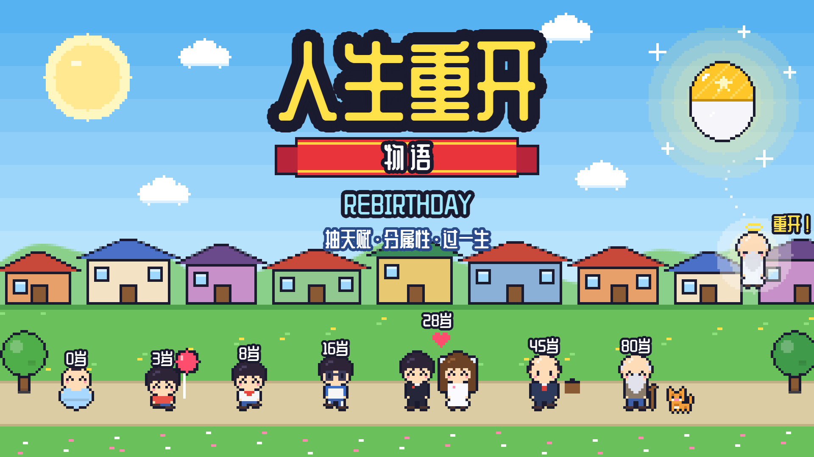

# 人生重开物语 Rebirthday

竖屏像素风人生模拟器：抽三个天赋，分二十点属性，然后一年一年地过完这一生。这辈子不行？那就重开。

**在线试玩：** https://grrreymane.github.io/Rebirthday/

## 怎么玩

- **天赋扭蛋**：先开出一颗命运胶囊，里面的「天命」天赋锁定不可改（可能是传说，也可能是诅咒，诅咒补偿 3 个属性点）；再从十连抽的 10 个天赋里自选 2 个
- **分配属性**：20 点分给颜值、智力、体质、家境，快乐初始为 5；家境决定你出生的摇篮
- **过一生**：点屏幕或「下一年」推进一岁，也可以开自动播放 / 加速；拖动日志可以往回翻
- **人生总结**：按一生中各项属性的最高值和寿命打分，从 D 到 SSS，外加一句墓志铭
- **轮回继承**：死后选一个天赋带到下一世，它一定会出现在下次的扭蛋里
- **轮回殿**：每一世按评价和新成就获得轮回点，换取永久升级：开局属性点、十一连抽、重抽扭蛋、逆天改命、双重继承
- **前世因果**：上一世会在这一世留下痕迹——前世的猫找上门、与前世的伴侣重逢、梦见前世、路过自己的墓碑……

## 内容

- 400 多条人生事件：抓周、上学、中考高考、恋爱结婚、生娃、买房、中年危机、退休、广场舞……
- 20 多种职业：程序员、公务员、医生、外卖骑手、主播、明星、电竞选手、科学家、航天员……
- 隐藏路线：修仙（青云宗正道 / 血煞宗魔修 / 万妖山妖修三条分支）、卡车转生异世界、被外星人绑架
- 23 个像素场景（产房、教室、办公室、工地、婚礼、青云宗、月球……），人物会随年龄长大变老、换校服工装、秃头、拄拐
- 家人同框：父母、伴侣、孩子、猫狗都会出现在场景里
- 46 个成就，解锁越多，抽到史诗和传说天赋的概率越高
- 每个人生阶段一首芯片音乐

## 本地运行

整个游戏是一个 `index.html`，没有构建步骤，直接用浏览器打开即可。成就、轮回次数和进行中的人生保存在浏览器本地存储里。
